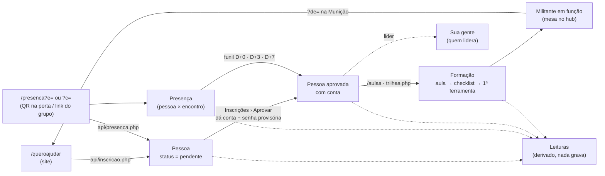

# Comece aqui — trinta minutos até publicar

Para quem nunca abriu este repositório. Ao fim, você roda o site, roda o
painel, roda os testes e sabe como uma mudança vai para o ar. O resto dos
docs é para depois.

## 1. O que é (dois minutos)

- **felipesmoreira.com** é um site de campanha e de militância — Felipe
  Moreira, candidato a Vice-Governador do Ceará na chapa de Huggo Leonardo,
  Partido Missão. Eleição em **04/10/2026**.
- **Duas metades num repositório só:**
  - o **site público** — Next.js 15, `output: "export"`: vira HTML estático
    em `out/` e é servido pelo Apache da Hostinger;
  - o **painel** — PHP puro em `public/painel/`, que roda ao lado do site na
    mesma hospedagem e grava em arquivos PHP em `public_html/dados/`
    (fora do git). É o backend de verdade: inscrição, presença, pessoas,
    encontros, formação, Munição, Caixa, Leituras.
- **Não há banco de dados nem framework PHP.** É decisão, não falta: uma
  hospedagem compartilhada, um autor, e cada dependência é uma que alguém
  audita antes de um deploy de campanha.

## 2. Rodar (dez minutos)

Pré-requisitos: **Node 24** e **PHP 8.1 ou mais** (`php -v`).

```sh
npm install
npm run dev            # o site em http://localhost:3000
npm run painel:local   # o painel em http://127.0.0.1:8081/painel/
```

O `painel:local` serve `public/` de verdade — edite um `.php`, recarregue.
Os dados ficam em `public/dados/` (ignorado pelo git). Sem conta ainda, a
primeira tela cria o administrador; para recomeçar do zero, apague a pasta.

O site em `:3000` chama o painel por `/painel/api/...` na mesma origem, então
as páginas que dependem da API (`/candidatos`, `/aulas`, `/presenca`) ficam
vazias no `next dev`. Para ver as duas metades juntas: `npm run build` e sirva
`out/` com o `php -S` apontado para lá — ou confie nos testes de ação, que é o
que eles fazem.

## 3. Testar (cinco minutos)

```sh
npm test               # contrato + ações + fumaça, ~40 s
npm run test:tipos     # tsc do site e dos testes
npm run lint
```

Três tipos, e a divisão importa (detalhe em `testes/LEIA-ME.md`):

| pasta | pergunta | como |
| --- | --- | --- |
| `testes/contrato/` | as duas cópias da mesma regra (PHP × TS) ainda concordam? | lê os arquivos, chama funções puras pelo `ponte.php` |
| `testes/acoes/` | a gravação faz o que promete e recusa o que promete recusar? | sobe um `php -S` numa cópia do painel com dados semeados e faz POST de verdade |
| `testes/fumaca/` | toda tela abre inteira e em silêncio? | renderiza cada tela pelo CLI e derruba o teste em qualquer `Warning` |

Regra da casa: **POST crítico pede teste de ação; par PHP/TS novo pede teste
de contrato; tela grande refatorada pede fumaça.** Item sem teste não conta
como feito.

## 4. Publicar (cinco minutos)

```text
git push origin main
   └─ .github/workflows/publish.yml
        npm install → npm test → npm run build
        copia funcoes.json, municipios-ce.json, dados-semente.json para out/
        gera os .htaccess (URLs limpas, prévia para robôs, cache)
        empurra out/ para a branch `build`
             └─ a Hostinger puxa `build` (integração Git do hPanel)
```

- Se `npm test` falhar, nada é publicado.
- `public_html/dados/` **não** faz parte do deploy — é o que o painel gravou.
- Não mexa sem alinhar: `next.config.ts`, `publish.yml`, os `.htaccess`
  gerados, `conceito.html`.

## 5. Onde mora o quê (cinco minutos)

```text
src/app/<rota>/page.tsx     metadata + delegação (fina)
src/features/<nome>/        UI, estado, dados de cada área do site
src/lib/theme.ts            cor, fonte, borda, sombra — a única paleta
src/lib/api/                um wrapper por endpoint do painel (apiFetch)
src/data/*.json             catálogos que o site E o painel leem
public/painel/<area>.php    a rota  → <area>-acoes.php (POST)
                                    → <area>-tela.php  (a tela)
                                    → <area>-comum.php (modelo e regras)
public/painel/sessao.php    sessão, login, trancas — inclui dominio.php,
                            util.php e pessoas-modelo.php
public/painel/dominio.php   AREAS, CAPACIDADES, CARGOS, REDES — o vocabulário
public/painel/api/*.php     o que o site público chama
public/painel/aulas-conteudo.php  o conteúdo das aulas (é código, de propósito)
testes/sandbox.ts           o painel de mentira dos testes
docs/                       os docs por tema; update/ tem a avaliação e o plano
```

## 6. O vocabulário (três minutos)

- **Pessoa** — a ficha única em `dados/pessoas.php`. Não existe cadastro
  paralelo: inscrito, presente, militante, candidato e conta são a mesma
  ficha em estados diferentes. **Telefone é a chave.**
- **tipo ≠ funções ≠ capacidades.** `tipo` é o que a pessoa é para o
  movimento (eleitor, apoiador, militante, coordenador, candidato).
  `funcoes` é o que ela faz (Olheiro, Recepção…). `capacidades` é o que ela
  abre no painel (comunicação, eventos, coordenação, liderança, adm).
  `areas` são as telas, derivadas das capacidades.
- **status** — `pendente` → `aprovada` ou `recusada`. Aprovar dá conta à
  ficha que já existe.
- **Presença** é relação (pessoa × encontro), nunca cópia da pessoa.
- **Mesa × leitura.** Mesa é onde se faz (fila, quadro, ficha). Leitura é
  onde se olha (funil, mapa, contagem). Leitura não mora dentro de mesa.
- **Origem** — o `?de=<slug>` que amarra quem trouxe quem.
- **Funil** — D+0 agradecer · D+3 conteúdo · D+7 convidar, depois do encontro.
- **Reativação** — quem esfriou (faltou, nunca entrou, parou, sumiu). É
  derivada: ninguém sai da lista por ser chamado, só por voltar.

## 7. O fluxo central



Tudo o que está na figura grava em `dados/*.php` por `gravar_*()`, passando
por `normalizar_*()` — o arquivo é o schema. O que muitos disparam ao mesmo
tempo passa por `com_trava()`.

## 8. Sua primeira tarefa

Escolha uma do `update/roteiro-das-notas.md` marcada como uma hora ou menos —
elas existem para isso. Um commit por item, `npm test` verde antes, e o item
não está feito sem a prova que a ficha dele pede.

Se algo aqui não bateu com o que você viu, o erro é deste arquivo: corrija-o
no mesmo commit.
